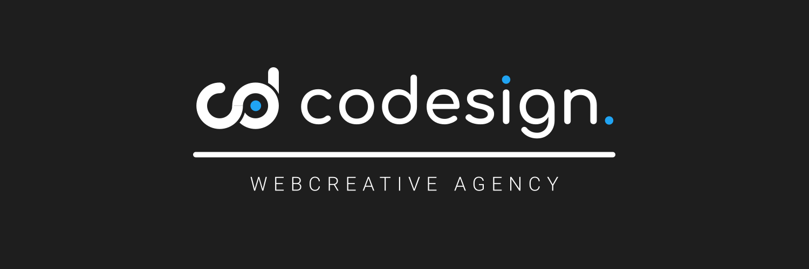

# 💫 Hello World! I'm Djordje, a Serbian Full Stack Developer 👋
🔭 currently working on Upwork as a freelance developer 
👨🏼‍🎓 studying computer science at Faculty of Electronic Engineering 
🚀 co-founder of codesign.rs 
💼 working at Polovni Telefoni 

# 💻 Tech Stack:
                       
# 📊 GitHub Stats: 
 

<picture>
  <source media="(prefers-color-scheme: dark)" srcset="https://raw.githubusercontent.com/djordjeivanovic02/djordjeivanovic02/output/github-snake-dark.svg" />
  <source media="(prefers-color-scheme: light)" srcset="https://raw.githubusercontent.com/djordjeivanovic02/djordjeivanovic02/output/github-snake.svg" />
  
</picture>
<!-- Proudly created with GPRM ( https://gprm.itsvg.in ) -->
